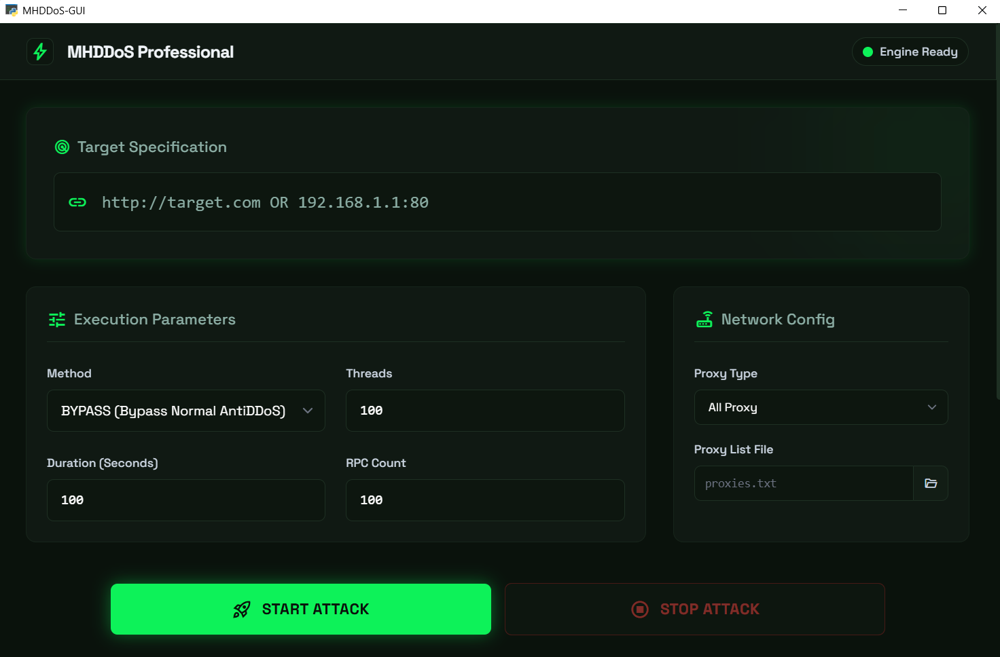

<!-- Improved compatibility of back to top link: See: https://github.com/othneildrew/Best-README-Template/pull/73 -->
<a id="readme-top"></a>

<!-- PROJECT SHIELDS -->
<div align="center">
  <a href="https://github.com/naravid19/MHDDoS-GUI/network/members"></a>
  <a href="https://github.com/naravid19/MHDDoS-GUI/stargazers"></a>
  <a href="https://github.com/naravid19/MHDDoS-GUI/issues"></a>
  <a href="https://github.com/naravid19/MHDDoS-GUI/blob/master/LICENSE"></a>
</div>

<!-- PROJECT LOGO -->
<br />
<div align="center">
  <a href="https://github.com/naravid19/MHDDoS-GUI">
    
  </a>

<h3 align="center">MHDDoS Professional v1.1.3</h3>

  <p align="center">
    A Modern, High-Performance Web & Desktop GUI for the renowned MHDDoS Script.
    <br />
    <br />
    <a href="https://github.com/naravid19/MHDDoS-GUI/issues/new?labels=bug">Report Bug</a>
    &middot;
    <a href="https://github.com/naravid19/MHDDoS-GUI/issues/new?labels=enhancement">Request Feature</a>
  </p>
</div>

<!-- TABLE OF CONTENTS -->
<details>
  <summary>Table of Contents</summary>
  <ol>
    <li>
      <a href="#about-the-project">About The Project</a>
      <ul>
        <li><a href="#features">Features</a></li>
        <li><a href="#built-with">Built With</a></li>
      </ul>
    </li>
    <li>
      <a href="#getting-started">Getting Started</a>
      <ul>
        <li><a href="#prerequisites">Prerequisites</a></li>
        <li><a href="#installation">Installation</a></li>
      </ul>
    </li>
    <li>
      <a href="#usage">Usage</a>
      <ul>
        <li><a href="#supported-methods">Supported Methods</a></li>
      </ul>
    </li>
    <li><a href="#roadmap">Roadmap</a></li>
    <li><a href="#disclaimer">Disclaimer</a></li>
    <li><a href="#contributing">Contributing</a></li>
    <li><a href="#contact">Contact</a></li>
    <li><a href="#acknowledgments">Acknowledgments</a></li>
  </ol>
</details>

<br />

<!-- ABOUT THE PROJECT -->
## About The Project

[](https://github.com/naravid19/MHDDoS-GUI)

**MHDDoS-GUI** is an advanced evolution of the original [MatrixTM/MHDDoS](https://github.com/MatrixTM/MHDDoS) script, now equipped with a stunning, highly optimized graphical user interface. Designed with premium glassmorphism aesthetics and built for absolute performance, this project provides both a Web Dashboard and a standalone Desktop Application to launch, monitor, and manage up to 47 distinct DDoS attack methods.

### Features
- **Time-Series Analytics Matrix**: Full interactive time-series matrix keeping up to 1 week of historical BPS/PPS data using high-performance downsampling algorithms.
- **Distributed Tactical Intelligence**: Persistent SQLite backend that records proxy performance across sessions enabling Warm Start deployments.
- **Advanced Evasion & Fingerprinting**: Dynamically reconstructs HTTP payloads with highly realistic browser fingerprints (Chrome, Firefox, Safari) and randomized headers to bypass modern WAF mitigations.
- **Command & Control (C2)**: Support for distributed multi-node orchestration.
- **Dynamic Worker Scaling**: Automatically scales active threads based on host machine CPU/RAM resources.
- **Advanced Proxy Ecosystem**: Real-time node failure tracking, shifting traffic dynamically toward high-uptime "Elite-Tier" proxies. Protocol-specific SSL/TLS handshake verification.
- **Intelligence Recon Matrix**: Built-in Geo-IP maps, signature-based WAF detection, and active Surface Explorers.
- **Premium Enterprise UI**: Engineered with "Glassmorphism 2.0" aesthetics, refined typography, CRT scanlines, and fluid CSS transitions.

<p align="right">(<a href="#readme-top">back to top</a>)</p>

### Built With

The project utilizes the following technologies for its tech-stack:

- [](https://www.python.org/)
- [](https://fastapi.tiangolo.com/)
- [](https://tailwindcss.com/)
- [](https://www.chartjs.org/)
- [](https://developer.mozilla.org/en-US/docs/Web/JavaScript)

<p align="right">(<a href="#readme-top">back to top</a>)</p>

<!-- GETTING STARTED -->
## Getting Started

Follow these simple steps to get your local environment set up.

### Prerequisites

Ensure you have Python 3 installed on your system.
* Python 3
  ```sh
  python --version
  ```

### Installation

1. Clone the repository
   ```sh
   git clone https://github.com/naravid19/MHDDoS-GUI.git
   ```
2. Navigate to the directory
   ```sh
   cd MHDDoS-GUI
   ```
3. Install the required Python packages
   ```sh
   pip install -r requirements.txt
   ```
4. Verify playwright installation (For advanced Web Browser engines)
   ```sh
   playwright install chromium
   ```

<p align="right">(<a href="#readme-top">back to top</a>)</p>

<!-- USAGE -->
## Usage

There are two primary ways to run the MHDDoS-GUI depending on your preference.

**1. Desktop Application Mode (Recommended)**  
Launch the GUI in a standalone application window for a seamless desktop experience:
```sh
python desktop_gui.py
```

**2. Web Dashboard Mode**  
Start the backend server and open the UI in your default web browser (accessible locally on port `8000`):
```sh
python web_gui.py
```

**3. Manual Commands (CLI)**  
You can still use the core script directly from the terminal if needed:
- Layer 7: `python start.py <method> <url> <socks_type> <threads> <proxylist> <rpc> <duration>`
- Layer 4: `python start.py <method> <ip:port> <threads> <duration>`

### Supported Methods
MHDDoS-GUI supports 47 methods. Here is a brief overview:

**Layer 7**  
`GET` | `POST` | `OVH` | `RHEX` | `STOMP` | `STRESS` | `DYN` | `DOWNLOADER` | `SLOW` | `HEAD` | `NULL` | `COOKIE` | `PPS` | `EVEN` | `GSB` | `DGB` | `AVB` | `BOT` | `APACHE` | `XMLRPC` | `CFB` | `CFBUAM` | `BYPASS` | `BOMB` | `KILLER` | `TOR`

**Layer 4 (Normal & Amplification)**  
`TCP` | `UDP` | `SYN` | `OVH-UDP` | `CPS` | `ICMP` | `CONNECTION` | `VSE` | `TS3` | `FIVEM` | `FIVEM-TOKEN` | `MEM` | `NTP` | `MCBOT` | `MINECRAFT` | `MCPE` | `DNS` | `CHAR` | `CLDAP` | `ARD` | `RDP`

<p align="right">(<a href="#readme-top">back to top</a>)</p>

<!-- ROADMAP -->
## Roadmap

- [x] Time-Series Analytics History
- [x] Command & Control (C2) Logic
- [x] Local Storage Auto-Saving Configuration
- [ ] Implement Distributed Task Dispatching (Remote execution)
- [ ] Expand Geo-IP Recon to include WAF bypassed telemetry analysis
- [x] Browser Data (LocalStorage) visualization persistence

See the [open issues](https://github.com/naravid19/MHDDoS-GUI/issues) for a full list of proposed features (and known issues).

<p align="right">(<a href="#readme-top">back to top</a>)</p>

<!-- DISCLAIMER -->
## Disclaimer

> [!CAUTION]
> This graphical representation and the underlying script represent a powerful network testing utility.
> The tool is meant for educational purposes and authorized network stress testing ONLY. Testing infrastructure without full legal authorization constitutes a cybercrime. The author is not responsible for any misuse.

<p align="right">(<a href="#readme-top">back to top</a>)</p>

<!-- CONTRIBUTING -->
## Contributing

Contributions are what make the open source community such an amazing place to learn, inspire, and create. Any contributions you make are **greatly appreciated**.

1. Fork the Project
2. Create your Feature Branch (`git checkout -b feature/AmazingFeature`)
3. Commit your Changes (`git commit -m 'Add some AmazingFeature'`)
4. Push to the Branch (`git push origin feature/AmazingFeature`)
5. Open a Pull Request

<p align="right">(<a href="#readme-top">back to top</a>)</p>

<!-- CONTACT -->
## Contact

Project Link: [https://github.com/naravid19/MHDDoS-GUI](https://github.com/naravid19/MHDDoS-GUI)

<p align="right">(<a href="#readme-top">back to top</a>)</p>

<!-- ACKNOWLEDGMENTS -->
## Acknowledgments

Huge thanks to the original creators and the open-source community that made this tool possible:

* [MatrixTM / MHDDoS](https://github.com/MatrixTM/MHDDoS) - The original powerful core script.
* [Othneil Drew / Best-README-Template](https://github.com/othneildrew/Best-README-Template) - For the amazing structural template.
* [React Icons](https://react-icons.github.io/react-icons/)
* [Tailwind CSS Components](https://tailwindui.com/)
* [FastAPI Framework](https://fastapi.tiangolo.com/)

<p align="right">(<a href="#readme-top">back to top</a>)</p>
