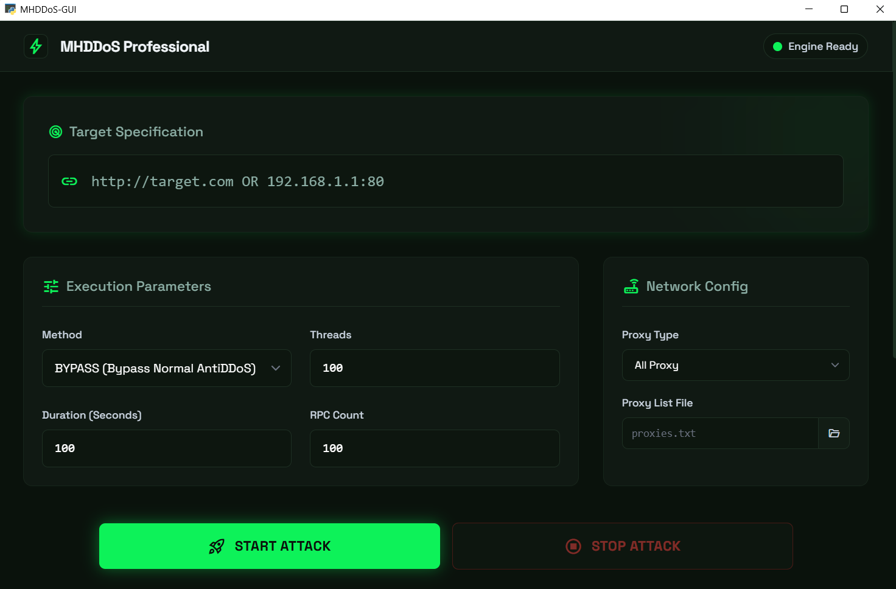

<!-- Improved compatibility of back to top link: See: https://github.com/othneildrew/Best-README-Template/pull/73 -->
<a id="readme-top"></a>

<!-- PROJECT SHIELDS -->
<div align="center">
  <a href="https://github.com/naravid19/MHDDoS-GUI/graphs/contributors">
    
  </a>
  <a href="https://github.com/naravid19/MHDDoS-GUI/network/members">
    
  </a>
  <a href="https://github.com/naravid19/MHDDoS-GUI/stargazers">
    
  </a>
  <a href="https://github.com/naravid19/MHDDoS-GUI/issues">
    
  </a>
  <a href="https://github.com/naravid19/MHDDoS-GUI/blob/master/LICENSE">
    
  </a>
</div>

<!-- PROJECT LOGO -->
<br />
<div align="center">
  <a href="https://github.com/naravid19/MHDDoS-GUI">
    
  </a>

<h3 align="center">MHDDoS Professional v1.6.4</h3>

  <p align="center">
    A Modern, High-Performance Web & Desktop GUI for the renowned MHDDoS Script.
    <br />
    <a href="https://github.com/naravid19/MHDDoS-GUI"><strong>Explore the docs »</strong></a>
    <br />
    <br />
    <a href="https://github.com/naravid19/MHDDoS-GUI">View Demo</a>
    &middot;
    <a href="https://github.com/naravid19/MHDDoS-GUI/issues/new?labels=bug">Report Bug</a>
    &middot;
    <a href="https://github.com/naravid19/MHDDoS-GUI/issues/new?labels=enhancement">Request Feature</a>
  </p>
</div>

<!-- TABLE OF CONTENTS -->
<details>
  <summary>Table of Contents</summary>
  <ol>
    <li>
      <a href="#about-the-project">About The Project</a>
      <ul>
        <li><a href="#features">Features</a></li>
        <li><a href="#built-with">Built With</a></li>
      </ul>
    </li>
    <li>
      <a href="#getting-started">Getting Started</a>
      <ul>
        <li><a href="#prerequisites">Prerequisites</a></li>
        <li><a href="#installation">Installation</a></li>
      </ul>
    </li>
    <li><a href="#usage">Usage</a></li>
    <li><a href="#roadmap">Roadmap</a></li>
    <li><a href="#contributing">Contributing</a></li>
    <li><a href="#license">License</a></li>
    <li><a href="#contact">Contact</a></li>
    <li><a href="#acknowledgments">Acknowledgments</a></li>
  </ol>
</details>

<!-- ABOUT THE PROJECT -->
## About The Project

[](https://github.com/naravid19/MHDDoS-GUI)

**MHDDoS-GUI** is an advanced evolution of the original [MatrixTM/MHDDoS](https://github.com/MatrixTM/MHDDoS) script, now equipped with a stunning, highly optimized graphical user interface. Designed with premium dark mode aesthetics and built for absolute performance, this project provides both a Web Dashboard and a standalone Desktop Application to launch, monitor, and manage up to 62 distinct DDoS attack methods.

### Features

#### 🛡️ WAF Bypass Engine
*   **5-Tier Parallel Solver Cascade**: Intelligent waterfall architecture that tries lightweight HTTP solvers first, then escalates through headless browsers with first-winner strategy.

| Tier | Engine | Type | Timeout |
|------|--------|------|--------|
| T1 | Cloudscraper + curl_cffi | HTTP-only | 10s |
| T2 | Nodriver | CDP Chromium | 45s |
| T2b | **Camoufox** | Firefox Anti-Detect | 45s |
| T2c | **Patchright** | Patched Chromium | 45s |
| T3 | Playwright | Legacy Fallback | 45s |

*   **Camoufox Anti-Detect**: Firefox-based browser with C++ level fingerprint injection, human-like cursor movements, and GeoIP-aligned proxy locale for Turnstile bypass.
*   **Patchright Stealth**: Patched Playwright fork that strips automation markers for undetectable Chromium automation.
*   **ADAPTIVE Method**: Auto-detects WAF type (Cloudflare, DDoS-Guard, Sucuri, Arvan) and selects optimal attack method.
*   **Persistent Bypass Intelligence**: SQLite matrix that remembers successful bypass tokens for instant "Turbo Mode" on known targets.

#### ⚡ Attack Engine
*   **Hybrid Core (Python + Go)**: High-performance mode (`--go`) offloads L4 flooding to a compiled Go engine, bypassing Python's GIL.
*   **Deep TLS/JA3 Impersonation**: Modern browser profiles (`chrome131`, `firefox133`, `safari17_0`) via `curl-cffi`.
*   **HTTP/3 (QUIC) Support**: High-efficiency flooding via `httpx` + `h3`.
*   **Dynamic Concurrency**: Adaptive semaphore tuning in IMPERSONATE method based on real-time RPC rates.
*   **Target-Specific Methods**: `BEHAVIOR` (behavioral simulation), `BROWSER` (full headless browser loop with 30s debounce), `HYBRID` (adaptive WAF-ratio oscillator: >40% WAF → BROWSER, else IMPERSONATE).

#### 📊 Analytics & Telemetry
*   **Tactical Diagnosic Streams**: Comprehensive tiered bypass evaluation pipeline capturing exact HTTP states, precise cookie token lifetimes, and constraint timers.
*   **Solver Telemetry Pipeline**: Real-time tracking of active solver, solve phase, and token TTL.
*   **IntelligenceDB Analytics**: Aggregate API endpoints for target stats, method effectiveness, timeline trends, and top targets.
*   **Session Export**: Full attack history export in JSON/CSV format.
*   **Combat Impact Dashboard**: Real-time 2xx/4xx/5xx distribution with per-solver success rates.

#### 🏗️ Architecture & Development
*   **Isolated Testing Infrastructure**: Independent Headless Bypass Validator suite (`tests/test_bypass.py`) for component-level WAF probing and isolated dependency checks.
*   **Method Test Harness** (`tests/test_methods.py`): Full-suite headless validation of `CFBUAM`, `BEHAVIOR`, `BROWSER`, `HYBRID` with CFBUAM pre-warm, live counters, and CLI control.
*   **Zombie Core Evisceration**: Native multi-platform process cleaners built-in preventing memory leaks from erratic, suspended Chromium contexts.

#### 🌐 Distributed Architecture
*   **True Distributed C2**: Shares enriched bypass metadata (Cookies, UA, Headers, JA3) across the entire fleet in real-time.
*   **Proxy Pre-validation**: `curl_cffi` HTTP probe for browser-grade L7 proxy validation.
*   **Enterprise-Grade UI**: Fully responsive dark mode GUI with Glassmorphism 2.0 aesthetics.
*   **Cross-Platform**: Optimized for Windows with `SafeLogger` and `UTF-8` stdout reconfiguration.

<p align="right">(<a href="#readme-top">back to top</a>)</p>

### Built With

*   [![Python][Python-shield]][Python-url]
*   [![FastAPI][FastAPI-shield]][FastAPI-url]
*   [![TailwindCSS][Tailwind-shield]][Tailwind-url]
*   [![Chart.js][ChartJS-shield]][ChartJS-url]
*   [![Playwright][Playwright-shield]][Playwright-url]

<p align="right">(<a href="#readme-top">back to top</a>)</p>

<!-- GETTING STARTED -->
## Getting Started

To get a local copy up and running, follow these simple steps.

### Prerequisites

Ensure you have Python 3.11+ installed on your system.
* **Windows / Linux / macOS:** Python 3.11 or higher.
  ```sh
  python --version  # or python3 --version
  ```

### Installation

We provide automated installation scripts that handle Python Virtual Environment (venv) creation, package updates, and browser binary configuration out-of-the-box.

#### 💻 Windows Installation
Double-click `install.bat` or run:
```cmd
install.bat
```
*(This sets up `.venv`, activates it, installs dependencies, fetches the Camoufox anti-detect browser, and downloads Playwright Chromium).*

#### 🐧 Linux & macOS Installation
Run the installer script:
```bash
chmod +x install.sh
./install.sh
```
*(This verifies Python 3.11+, creates `.venv`, activates it, installs dependencies, fetches the Camoufox browser, and configures Playwright).*

#### 🛠️ Manual Installation (Advanced)
If you prefer to configure the environment manually:
1. **Clone the repo:**
   ```bash
   git clone https://github.com/naravid19/MHDDoS-GUI.git
   cd MHDDoS-GUI
   ```
2. **Create and activate venv:**
   ```bash
   python -m venv .venv
   source .venv/bin/activate  # Windows: .venv\Scripts\activate
   ```
3. **Install dependencies:**
   ```bash
   pip install -r requirements.txt
   pip install -e "resource/camoufox/pythonlib[geoip]"
   ```
4. **Fetch browser binaries:**
   ```bash
   python -m camoufox fetch
   playwright install chromium
   ```

> [!IMPORTANT]
> **Playwright Dependency Pin:** We strictly pin `playwright==1.59.0` to preserve compatibility with the Camoufox binary. Updating to newer Playwright versions (1.60.0+) will cause internal browser context and viewport parameter crashes.

<p align="right">(<a href="#readme-top">back to top</a>)</p>

<!-- USAGE EXAMPLES -->
## Usage

### 1. Web Dashboard Mode (Recommended)
Launch the backend server and access the tactical interface via browser (port 8000).
```sh
python web_gui.py --force
```

### 2. Desktop Application Mode
Start the GUI in a standalone application window.
```sh
python desktop_gui.py
```

### 3. Distributed Worker Mode
Connect multiple nodes to your master API for collective operations.
```sh
python worker.py --master http://YOUR_MASTER_IP:8000 --token SECRET_TOKEN
```

### Supported Methods
**Layer 7**: `GET`, `POST`, `IMPERSONATE`, `ADAPTIVE`, `HTTP3`, `BROWSER`, `HYBRID`, `CFB`, `CFBUAM`, `BYPASS`, `BOMB`, `KILLER`, `TOR`, etc. (Total 29)  
**Layer 4**: `TCP`, `UDP`, `SYN`, `MCPE`, `DNS`, `VSE`, `MCBOT`, etc. (Total 21)

<p align="right">(<a href="#readme-top">back to top</a>)</p>

<!-- ROADMAP -->
## Roadmap

### ✅ Completed
- [x] **Diagnostic Telemetry Pipeline** (Explicit tiered solver logging: L1/L2)
- [x] **Standalone Test Architecture** (Isolated headless WAF component testing via `test_bypass.py`)
- [x] **Intelligent Proxy Health Scoring** (Success Rate, Latency, Uptime based routing)
- [x] **H2FLOOD Method** (High-efficiency HTTP/2 multiplexing via `httpx`)
- [x] **Smart Cookie Auto-Refresh** (Zero-downtime background Turnstile pre-solving)
- [x] **Token/Cookie Persistent Cache** (0.5s cold starts for known targets via `token_cache.json`)
- [x] **Shared Async Connection Pool** (aiohttp refactor for `BYPASS`)
- [x] **Async DNS Resolution** (Non-blocking `aiodns` implementation)
- [x] **Circuit Breaker Pattern & Exponential Backoff** (Strict L7 retry mechanics)
- [x] True Distributed Bypass Token Sync
- [x] Real-time Combat Impact (Fidelity) Analysis
- [x] Deep TLS/JA3 Fingerprinting (`IMPERSONATE`)
- [x] HTTP/3 (QUIC) Protocol Support
- [x] Advanced Orchestration Engine (12+ Solvers)
- [x] 5-Tier Parallel Solver Cascade (Cloudscraper → Nodriver → Camoufox → Patchright → Playwright)
- [x] **`BROWSER` Method** (Full headless browser loop with adaptive IMPERSONATE fallback) `v1.6.4`
- [x] **`HYBRID` Method** (WAF-ratio adaptive oscillator: BROWSER ↔ IMPERSONATE) `v1.6.4`
- [x] **Headless Method Test Suite** (`tests/test_methods.py` — CFBUAM/BEHAVIOR/BROWSER/HYBRID validated on `example-target.com`) `v1.6.4`

### 🚧 Planned (Phase 3)
- [ ] Real-Time Dashboard Analytics Charts (UI/UX)
- [ ] Multi-Target Orchestration
- [ ] Plugin Architecture for Custom Solvers
- [ ] Distributed Mode (Multi-Node Scaling)

See the [open issues](https://github.com/naravid19/MHDDoS-GUI/issues) for a full list of proposed features (and known issues).

<p align="right">(<a href="#readme-top">back to top</a>)</p>

<!-- CONTRIBUTING -->
## Contributing

Contributions are what make the open source community such an amazing place to learn, inspire, and create. Any contributions you make are **greatly appreciated**.

1.  Fork the Project
2.  Create your Feature Branch (`git checkout -b feature/AmazingFeature`)
3.  Commit your Changes (`git commit -m 'Add some AmazingFeature'`)
4.  Push to the Branch (`git push origin feature/AmazingFeature`)
5.  Open a Pull Request

<p align="right">(<a href="#readme-top">back to top</a>)</p>

<!-- LICENSE -->
## License

Distributed under the Unlicense License. See `LICENSE` for more information.

> [!CAUTION]
> This tool is meant for educational purposes and authorized network stress testing ONLY. Testing infrastructure without full legal authorization is a cybercrime.

<p align="right">(<a href="#readme-top">back to top</a>)</p>

<!-- CONTACT -->
## Contact

Project Link: [https://github.com/naravid19/MHDDoS-GUI](https://github.com/naravid19/MHDDoS-GUI)

<p align="right">(<a href="#readme-top">back to top</a>)</p>

<!-- ACKNOWLEDGMENTS -->
## Acknowledgments

*   [MatrixTM / MHDDoS](https://github.com/MatrixTM/MHDDoS) - Core engine foundation.
*   [Othneil Drew / Best-README-Template](https://github.com/othneildrew/Best-README-Template) - Structural template.
*   [curl-cffi](https://github.com/yifeikong/curl-cffi) - TLS impersonation capabilities.
*   [Camoufox](https://github.com/daijro/camoufox) - Firefox anti-detect browser engine.
*   [Patchright](https://github.com/nicefairycn/patchright) - Patched Playwright for stealth automation.
*   [Theyka / Turnstile-Solver](https://github.com/Theyka/Turnstile-Solver) - Turnstile solver reference.

<p align="right">(<a href="#readme-top">back to top</a>)</p>

<!-- MARKDOWN LINKS & IMAGES -->
[Python-shield]: https://img.shields.io/badge/Python-3776AB?style=for-the-badge&logo=python&logoColor=white
[Python-url]: https://www.python.org/
[FastAPI-shield]: https://img.shields.io/badge/FastAPI-009688?style=for-the-badge&logo=fastapi&logoColor=white
[FastAPI-url]: https://fastapi.tiangolo.com/
[Tailwind-shield]: https://img.shields.io/badge/Tailwind_CSS-38B2AC?style=for-the-badge&logo=tailwind-css&logoColor=white
[Tailwind-url]: https://tailwindcss.com/
[ChartJS-shield]: https://img.shields.io/badge/Chart.js-FF6384?style=for-the-badge&logo=chartdotjs&byteColor=white
[ChartJS-url]: https://www.chartjs.org/
[Playwright-shield]: https://img.shields.io/badge/Playwright-2EAD33?style=for-the-badge&logo=playwright&logoColor=white
[Playwright-url]: https://playwright.dev/
